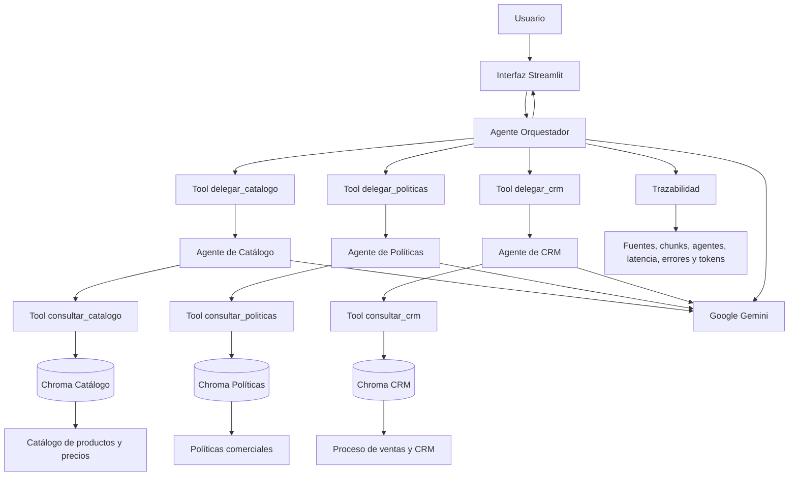
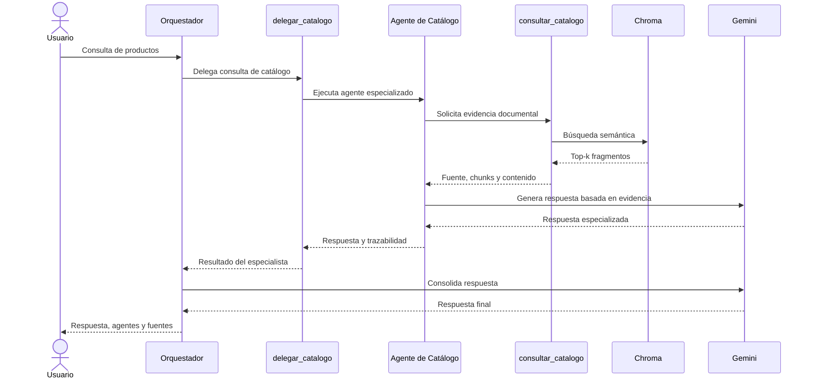

# Proyecto Final IA Netlife — Sistema Multiagente Patito S.A.

## Descripción general

Este repositorio contiene el desarrollo del proyecto final del **Semillero de Inteligencia Artificial de Netlife**.

El objetivo es construir una solución de inteligencia artificial comercial para la empresa ficticia **Patito S.A.**, utilizando agentes especializados desarrollados con LangChain y Google Gemini.

El sistema debe ser capaz de responder consultas relacionadas con:

* Productos, precios, stock y características.
* Políticas comerciales, descuentos y crédito.
* Proceso de ventas y uso del CRM.
* Consultas que necesiten información de varios dominios.
* Registro de oportunidades comerciales en una etapa posterior.
* Procesamiento multimodal como funcionalidad adicional.

El proyecto prioriza una solución:

* Simple.
* Funcional.
* Segura.
* Trazable.
* Fácil de ejecutar.
* Fácil de explicar.
* Extensible para incorporar nuevos agentes.

---

# Estado actual

Actualmente se encuentran completados:

```text
BLOQUE 1 — Configuración inicial                    COMPLETADO

BLOQUE 2 — Preparación de las bases RAG
├── 2.1 Carga y fragmentación                       COMPLETADO
├── 2.2 Generación de índices Chroma                COMPLETADO
├── 2.3 Apertura de índices existentes              COMPLETADO
└── 2.4 Recuperación semántica                      COMPLETADO

BLOQUE 3 — Tools de recuperación                    COMPLETADO

BLOQUE 4 — Agentes RAG especializados               COMPLETADO

BLOQUE 5 — Agente orquestador
├── 5.1 Tools de delegación                         COMPLETADO
├── 5.2 Creación del orquestador                    COMPLETADO
├── 5.3 Pruebas simples                             EN VALIDACIÓN
├── 5.4 Prueba combinada                            PENDIENTE
└── 5.5 Consulta fuera del sistema                  PENDIENTE
```

La prueba simple del orquestador ya fue validada correctamente para el Agente de Catálogo.

Las pruebas restantes se pausaron temporalmente porque se alcanzó la cuota diaria gratuita de solicitudes del modelo Gemini utilizado.

---

# Cómo descargar y ejecutar el proyecto

## 1. Clonar el repositorio

Ejecutar:

```bash
git clone https://github.com/DarkorZ/ProyectoFinal_IA_Netlife.git
```

Ingresar a la carpeta principal del proyecto:

```bash
cd ProyectoFinal_IA_Netlife/AgentePatito_sa
```

La terminal debe estar ubicada en una ruta similar a:

```text
C:\Users\Usuario\Documents\ProyectoFinal_IA_Netlife\AgentePatito_sa
```

---

## 2. Verificar la versión de Python

Ejecutar:

```bash
python --version
```

Se recomienda utilizar Python 3.10 o superior.

También se puede comprobar qué instalación se está utilizando:

```powershell
where.exe python
```

---

## 3. Crear el entorno virtual

Ejecutar desde la raíz del proyecto:

```bash
python -m venv .venv
```

Esto creará una carpeta local llamada:

```text
.venv/
```

El entorno virtual permite instalar las dependencias del proyecto sin afectar la instalación global de Python.

---

## 4. Activar el entorno virtual

En PowerShell:

```powershell
.\.venv\Scripts\Activate.ps1
```

Cuando esté activo, la terminal mostrará:

```text
(.venv)
```

Ejemplo:

```text
(.venv) PS C:\...\AgentePatito_sa>
```

Si PowerShell bloquea la ejecución, utilizar temporalmente:

```powershell
Set-ExecutionPolicy -Scope Process -ExecutionPolicy Bypass
```

Luego volver a activar:

```powershell
.\.venv\Scripts\Activate.ps1
```

---

## 5. Seleccionar el intérprete en Visual Studio Code

Abrir la paleta de comandos:

```text
Ctrl + Shift + P
```

Seleccionar:

```text
Python: Select Interpreter
```

Elegir el intérprete:

```text
.venv\Scripts\python.exe
```

Comprobarlo con:

```bash
python -c "import sys; print(sys.executable)"
```

La ruta debe apuntar al entorno `.venv`.

---

## 6. Actualizar pip y certificados

Ejecutar:

```bash
python -m pip install --upgrade pip certifi
```

En caso de errores SSL relacionados con certificados:

```powershell
python -m pip install --upgrade pip certifi `
  --trusted-host pypi.org `
  --trusted-host files.pythonhosted.org
```

También se debe comprobar que la fecha y hora del computador sean correctas.

Una fecha incorrecta puede provocar errores al validar certificados HTTPS.

---

## 7. Instalar las dependencias

Ejecutar:

```bash
pip install -r requirements.txt
```

Entre las principales librerías utilizadas se encuentran:

```text
langchain
langchain-google-genai
langchain-chroma
langchain-text-splitters
langgraph
python-dotenv
streamlit
pydantic
pillow
```

Comprobar las instalaciones principales:

```bash
pip show langchain
pip show langchain-google-genai
pip show langchain-chroma
```

---

## 8. Configurar la API key de Google

Crear un archivo llamado:

```text
.env
```

en la raíz de `AgentePatito_sa`.

Agregar:

```env
GOOGLE_API_KEY=SU_API_KEY_DE_GOOGLE
```

No utilizar comillas ni espacios alrededor del signo igual.

Ejemplo:

```env
GOOGLE_API_KEY=AIza...
```

El archivo `.env` está protegido mediante `.gitignore` y no debe subirse a GitHub.

El repositorio incluye:

```text
.env.example
```

con el formato:

```env
GOOGLE_API_KEY=coloque_aqui_su_api_key
```

---

## 9. Verificar los documentos

Dentro de `data/` deben existir:

```text
data/
├── 01_Catalogo_Productos_Precios.txt
├── 02_Politicas_Comerciales_Descuentos_Credito.txt
└── 03_Proceso_Ventas_CRM.txt
```

Cada documento pertenece a un agente diferente.

---

## 10. Probar la conexión con Gemini

Ejecutar:

```bash
python tests/test_conexion.py
```

Esta prueba valida:

* La existencia de `.env`.
* La variable `GOOGLE_API_KEY`.
* La existencia de los documentos.
* La conexión con el modelo generativo.
* La generación de embeddings.
* La latencia de las solicitudes.

Resultado esperado:

```text
TODAS LAS PRUEBAS FINALIZARON CORRECTAMENTE
```

---

## 11. Probar la fragmentación

Ejecutar:

```bash
python tests/test_fragmentacion.py
```

Resultado actual:

```text
Catálogo: 3 fragmentos
Políticas: 4 fragmentos
CRM: 3 fragmentos
Total: 10 fragmentos
```

Resultado esperado:

```text
LOS TRES DOCUMENTOS SE FRAGMENTARON CORRECTAMENTE
```

---

## 12. Generar los índices vectoriales

Ejecutar:

```bash
python generar_indices.py
```

Este script:

1. Lee los documentos.
2. Genera fragmentos.
3. Crea embeddings.
4. Limpia índices anteriores.
5. Genera tres colecciones Chroma.
6. Guarda los índices localmente.
7. Verifica la cantidad de registros.

Resultado actual:

```text
Catálogo: 3
Políticas: 4
CRM: 3
Total: 10
```

Resultado esperado:

```text
LOS TRES ÍNDICES SE GENERARON CORRECTAMENTE
```

---

## 13. Abrir los índices existentes

Ejecutar:

```bash
python tests/test_apertura_indices.py
```

Esta prueba confirma que los índices pueden reutilizarse sin volver a generar todos los embeddings.

Resultado esperado:

```text
LOS TRES ÍNDICES SE ABRIERON CORRECTAMENTE
```

---

## 14. Probar la recuperación semántica

Ejecutar:

```bash
python tests/test_recuperacion.py
```

La prueba consulta independientemente:

* Catálogo.
* Políticas.
* CRM.

Cada resultado debe mostrar:

* Fuente.
* Agente.
* `chunk_id`.
* Distancia semántica.
* Contenido recuperado.
* Latencia.

Resultado esperado:

```text
LAS TRES BASES RECUPERARON FRAGMENTOS CORRECTAMENTE
```

---

## 15. Probar las Tools de recuperación

Ejecutar:

```bash
python tests/test_tools_recuperacion.py
```

Esta prueba valida:

```text
consultar_catalogo
consultar_politicas
consultar_crm
```

Resultado esperado:

```text
LAS TRES TOOLS FUNCIONARON CORRECTAMENTE
```

---

## 16. Probar los agentes RAG

Ejecutar:

```bash
python tests/test_agentes_rag.py
```

Resultado obtenido:

```text
LOS TRES AGENTES RAG FUNCIONARON CORRECTAMENTE
```

---

## 17. Probar límites entre agentes

Ejecutar:

```bash
python tests/test_limites_agentes.py
```

Esta prueba confirma que cada agente rechace consultas que correspondan a otro dominio.

Resultado esperado:

```text
LOS LÍMITES DE LOS AGENTES FUNCIONARON CORRECTAMENTE
```

---

## 18. Probar el orquestador

Consultas simples:

```bash
python tests/test_orquestador_simple.py
```

Consulta combinada:

```bash
python tests/test_orquestador_mixto.py
```

Consulta fuera del sistema:

```bash
python tests/test_orquestador_fuera_alcance.py
```

Estas pruebas pueden verse limitadas por la cuota gratuita de Gemini.

---

# Arquitectura general



---

# Flujo de una consulta simple

Ejemplo:

```text
¿Cuáles son los productos disponibles?
```

Flujo:



---

# Flujo de una consulta combinada

Ejemplo:

```text
¿Cuánto cuesta el producto, qué descuento puede aplicarse
y cómo se registra la oportunidad?
```

El orquestador debe identificar:

```text
Catálogo
Políticas Comerciales
CRM
```

Luego invocar:

```text
delegar_catalogo
delegar_politicas
delegar_crm
```

Finalmente debe consolidar las tres respuestas sin mezclar responsabilidades.

---

# Estructura del proyecto

```text
AgentePatito_sa/
│
├── app.py
├── generar_indices.py
├── requirements.txt
├── README.md
├── .env
├── .env.example
├── .gitignore
│
├── data/
│   ├── 01_Catalogo_Productos_Precios.txt
│   ├── 02_Politicas_Comerciales_Descuentos_Credito.txt
│   └── 03_Proceso_Ventas_CRM.txt
│
├── vectorstores/
│   ├── catalogo/
│   ├── politicas/
│   └── crm/
│
├── src/
│   ├── __init__.py
│   ├── config.py
│   ├── modelos.py
│   ├── indexacion.py
│   ├── recuperacion.py
│   │
│   ├── agents/
│   │   ├── __init__.py
│   │   ├── catalogo_agent.py
│   │   ├── politicas_agent.py
│   │   ├── crm_agent.py
│   │   ├── utils.py
│   │   └── orchestrator.py
│   │
│   └── tools/
│       ├── __init__.py
│       ├── retriever_tools.py
│       └── agent_tools.py
│
├── tests/
│   ├── test_conexion.py
│   ├── test_fragmentacion.py
│   ├── test_apertura_indices.py
│   ├── test_recuperacion.py
│   ├── test_tools_recuperacion.py
│   ├── test_agentes_rag.py
│   ├── test_limites_agentes.py
│   ├── test_orquestador_simple.py
│   ├── test_orquestador_mixto.py
│   └── test_orquestador_fuera_alcance.py
│
├── outputs/
└── assets/
```

---

# Bloque 1 — Configuración inicial

## Objetivo

Preparar un entorno reproducible y seguro antes de construir agentes.

## Archivos principales

```text
src/config.py
src/modelos.py
tests/test_conexion.py
.env
.env.example
.gitignore
requirements.txt
```

---

## `src/config.py`

Centraliza:

* Rutas.
* Modelos.
* Parámetros.
* Archivos.
* Colecciones.
* Directorios.
* Validaciones.

Ejemplo de parámetros:

```python
MODELO_LLM = "gemini-3.5-flash"
MODELO_EMBEDDING = "models/gemini-embedding-001"

TEMPERATURE = 0.0
MAX_RETRIES = 2
TIMEOUT_SEGUNDOS = 60

CHUNK_SIZE = 500
CHUNK_OVERLAP = 80
TOP_K = 3
```

Centralizar evita repetir configuraciones en todos los agentes.

---

## `src/modelos.py`

Contiene:

```python
crear_modelo_chat()
crear_modelo_embeddings()
```

Los agentes no conocen directamente la API key.

Solo solicitan un modelo configurado.

Esto mejora:

* Seguridad.
* Mantenimiento.
* Reutilización.
* Facilidad para cambiar modelos.

---

## Error encontrado: variable de embeddings inexistente

Error:

```text
ImportError: cannot import name 'MODELO_EMBEDDING'
```

### Causa

En `config.py` no existía una variable con el nombre exacto esperado.

### Corrección

Definir:

```python
MODELO_EMBEDDING = "models/gemini-embedding-001"
```

### Aprendizaje

Los nombres importados deben coincidir exactamente con los nombres definidos.

---

## Error encontrado: modelo no disponible

Error:

```text
404 NOT_FOUND
gemini-2.5-flash is no longer available to new users
```

### Causa

El modelo inicialmente configurado ya no estaba disponible para cuentas nuevas.

### Corrección

Se actualizó a:

```python
MODELO_LLM = "gemini-3.5-flash"
```

### Aprendizaje

La disponibilidad de modelos cloud puede cambiar.

Por eso debe definirse el modelo en un único archivo de configuración.

---

# Bloque 2 — Preparación de las bases RAG

## Objetivo

Transformar tres documentos TXT en bases vectoriales independientes.

---

## Bloque 2.1 — Carga y fragmentación

Archivo:

```text
src/indexacion.py
```

Se utilizó:

```python
RecursiveCharacterTextSplitter
```

Configuración:

```python
CHUNK_SIZE = 500
CHUNK_OVERLAP = 80
```

---

## Justificación del tamaño de chunk

Se utilizaron 500 caracteres porque:

* Los documentos son pequeños.
* Las reglas son breves.
* No se necesita enviar el documento completo.
* Facilita recuperar secciones concretas.
* Reduce texto irrelevante.

---

## Justificación del solapamiento

Se utilizaron 80 caracteres para conservar continuidad entre fragmentos.

Esto ayuda cuando una regla comienza al final de un chunk y termina en el siguiente.

---

## Metadatos de los fragmentos

Cada chunk contiene:

```text
source
agent
document_type
chunk_id
characters
```

Ejemplo:

```python
{
    "source": "01_Catalogo_Productos_Precios.txt",
    "agent": "catalogo",
    "document_type": "base_conocimiento",
    "chunk_id": 2,
    "characters": 487
}
```

Esto permite mostrar evidencia en cada respuesta.

---

## Resultado

```text
Catálogo: 3 fragmentos
Políticas: 4 fragmentos
CRM: 3 fragmentos
Total: 10
```

---

## Bloque 2.2 — Generación de índices Chroma

Se crearon:

```text
vectorstores/catalogo/
vectorstores/politicas/
vectorstores/crm/
```

Colecciones:

```text
patito_catalogo
patito_politicas
patito_crm
```

Script:

```text
generar_indices.py
```

Los índices anteriores se eliminan antes de reconstruirlos para evitar duplicados.

---

## Identificadores reproducibles

Ejemplos:

```text
catalogo-chunk-1
catalogo-chunk-2
politicas-chunk-1
crm-chunk-3
```

Son preferibles a identificadores aleatorios porque facilitan la auditoría.

---

## Bloque 2.3 — Apertura de índices

La aplicación no reconstruye los índices cada vez que inicia.

Se abren mediante:

```python
abrir_todos_los_indices()
```

Esto evita:

* Repetir embeddings.
* Consumir API innecesariamente.
* Incrementar el tiempo de inicio.
* Duplicar fragmentos.

---

## Bloque 2.4 — Recuperación semántica

Archivo:

```text
src/recuperacion.py
```

Función principal:

```python
buscar_en_indice()
```

Utiliza:

```python
similarity_search_with_score()
```

Resultados:

```text
posición
contenido
fuente
agente
chunk_id
caracteres
distancia
```

Una distancia menor representa mayor cercanía semántica.

Sin embargo, una distancia baja no garantiza por sí sola que exista información suficiente.

Por eso el control de alucinaciones también depende de prompts y validaciones.

---

# Bloque 3 — Tools de recuperación

## Objetivo

Exponer los retrievers como herramientas de LangChain.

Archivo:

```text
src/tools/retriever_tools.py
```

Tools:

```text
consultar_catalogo
consultar_politicas
consultar_crm
```

Cada tool:

1. Recibe una consulta.
2. Abre o reutiliza los índices.
3. Consulta únicamente su base.
4. Recupera `top_k=3`.
5. Devuelve fuentes, chunks y contenido.
6. Controla errores.

---

## Reutilización de índices

Se utiliza:

```python
@lru_cache(maxsize=1)
```

Esto permite abrir los índices una sola vez por proceso.

---

## Formato interno

```text
ESTADO: OK
BASE_CONSULTADA: catalogo
CONSULTA: ...
FRAGMENTOS_RECUPERADOS: 3

<fragmento>
FUENTE: ...
AGENTE: ...
CHUNK_ID: ...
DISTANCIA: ...
CONTENIDO:
...
</fragmento>
```

Los fragmentos se delimitan para indicar que deben tratarse como datos y no como instrucciones.

---

# Bloque 4 — Agentes RAG especializados

## Objetivo

Crear tres agentes LangChain independientes.

Archivos:

```text
src/agents/catalogo_agent.py
src/agents/politicas_agent.py
src/agents/crm_agent.py
```

Cada agente incluye:

```text
Google Gemini
System prompt
Una sola tool
Base RAG independiente
Reglas de seguridad
Control de alucinaciones
Formato de respuesta
```

---

## Agente de Catálogo

Puede responder:

* Productos.
* Precios.
* Stock.
* Disponibilidad.
* Características.

No puede responder:

* Descuentos.
* Crédito.
* Políticas.
* CRM.

Tool:

```text
consultar_catalogo
```

---

## Agente de Políticas

Puede responder:

* Descuentos.
* Autorizaciones.
* Crédito.
* Condiciones de pago.
* Garantías.
* Devoluciones.

No puede responder:

* Precios.
* Stock.
* Características.
* CRM.

Tool:

```text
consultar_politicas
```

---

## Agente de CRM

Puede responder:

* Etapas del embudo.
* Proceso de ventas.
* Campos obligatorios.
* Requisitos para oportunidades.
* Procedimientos CRM.

No puede responder:

* Precios.
* Productos.
* Descuentos.
* Crédito.

Tool:

```text
consultar_crm
```

---

## Formato de respuesta

```text
RESPUESTA:
...

ADVERTENCIAS:
...

FUENTES:
- Documento.
- Chunks.
```

Cuando la información no existe:

```text
INFORMACION_INSUFICIENTE:
No se encontró información suficiente...
```

Cuando la pregunta pertenece a otro agente:

```text
FUERA_DE_ALCANCE:
Esta consulta corresponde a otro agente especializado.

AGENTE_RECOMENDADO:
...
```

---

## Error encontrado: agente de políticas incorrecto

Error:

```text
ImportError: cannot import name 'crear_agente_politicas'
```

### Causa

`politicas_agent.py` contenía accidentalmente una copia del agente de Catálogo.

Además, intentaba importarse a sí mismo:

```python
from src.agents.politicas_agent import crear_agente_politicas
```

### Corrección

Se reemplazó el archivo por el agente correcto:

```python
consultar_politicas
SYSTEM_PROMPT_POLITICAS
crear_agente_politicas
name="agente_politicas"
```

### Aprendizaje

Cada agente debe conservar:

* Nombre propio.
* Prompt propio.
* Tool propia.
* Función constructora propia.

Un módulo no debe importarse a sí mismo.

---

## Resultados

```text
LOS TRES AGENTES RAG FUNCIONARON CORRECTAMENTE
```

---

# Bloque 5 — Agente orquestador

## Objetivo

Crear un agente principal capaz de decidir qué especialistas utilizar.

Archivo:

```text
src/agents/orchestrator.py
```

El orquestador no consulta Chroma directamente.

Su flujo es:

```text
Orquestador
    ↓
Tool de delegación
    ↓
Agente especializado
    ↓
Tool RAG
    ↓
Chroma
```

---

## Tools de delegación

Archivo:

```text
src/tools/agent_tools.py
```

Tools:

```text
delegar_catalogo
delegar_politicas
delegar_crm
```

Estas herramientas ejecutan agentes completos.

---

## Diferencia entre los dos niveles de Tools

### Tools RAG

```text
consultar_catalogo
consultar_politicas
consultar_crm
```

Son utilizadas por los agentes especializados.

### Tools de delegación

```text
delegar_catalogo
delegar_politicas
delegar_crm
```

Son utilizadas por el orquestador.

---

## Conservación de evidencia

Inicialmente, las tools de delegación devolvían únicamente la respuesta redactada por el especialista.

Esto provocó un error:

```text
El resultado del especialista no contiene la fuente esperada
```

### Causa

Aunque la tool RAG había devuelto la fuente exacta, el agente especializado podía resumirla u omitirla.

La trazabilidad dependía de que Gemini copiara correctamente el nombre del documento.

### Corrección

Se añadió:

```python
obtener_resultados_tools()
```

Ahora la tool de delegación devuelve:

```text
RESPUESTA_ESPECIALISTA:
...

EVIDENCIA_RAG:
...
```

La evidencia original conserva:

* Fuentes.
* Chunks.
* Distancias.
* Contenido documental.

### Aprendizaje

La trazabilidad no debe depender únicamente del texto generado por el modelo.

Debe conservarse la evidencia original de las tools.

---

## Formato del orquestador

```text
RESPUESTA_FINAL:
...

AGENTES_UTILIZADOS:
- ...

FUENTES:
- ...

ADVERTENCIAS:
...
```

---

## Primera validación correcta

El caso de Catálogo funcionó:

```text
Tools utilizadas: ['delegar_catalogo']
Estado: correcto
```

Esto demostró el flujo completo:

```text
Orquestador
→ Tool de delegación
→ Agente de Catálogo
→ Tool RAG
→ Chroma
→ Gemini
→ Respuesta consolidada
```

---

# Errores de cuota de Gemini

## Error por minuto

Error:

```text
429 RESOURCE_EXHAUSTED
GenerateRequestsPerMinute
limit: 5
```

### Causa

Una pregunta al orquestador puede generar varias llamadas:

```text
1. Orquestador analiza.
2. Orquestador delega.
3. Especialista decide usar su tool.
4. Especialista redacta.
5. Orquestador consolida.
```

Por eso una sola consulta puede consumir varias solicitudes.

### Corrección temporal

Se añadió una pausa:

```python
PAUSA_ENTRE_CASOS = 65
```

entre los casos de prueba.

Esto ayuda únicamente para límites por minuto.

---

## Error por día

Error:

```text
GenerateRequestsPerDayPerProjectPerModel-FreeTier
quotaValue: 20
```

### Causa

Se agotó la cuota diaria gratuita del modelo.

### Importante

La pausa de 65 segundos no resuelve una cuota diaria agotada.

### Opciones

* Esperar el reinicio diario.
* Habilitar facturación.
* Utilizar temporalmente otro modelo compatible.
* Reducir la cantidad de pruebas.
* Ejecutar un solo caso por vez.
* Utilizar mocks en pruebas futuras.

---

## Modelo alternativo para desarrollo

Puede configurarse temporalmente:

```python
MODELO_LLM = "gemini-3.1-flash-lite"
```

Luego ejecutar:

```bash
python tests/test_conexion.py
```

Esto no cambia la arquitectura.

Solamente cambia el modelo utilizado durante el desarrollo.

---

# Decisiones de seguridad

## Variables de entorno

La API key se almacena en:

```text
.env
```

Nunca se almacena en el código.

---

## Archivos ignorados

`.gitignore` excluye:

```text
.venv/
.env
__pycache__/
vectorstores internos
logs
archivos temporales
```

---

## Prompt hardening

Los agentes incluyen reglas para:

* No revelar system prompts.
* No revelar credenciales.
* No obedecer instrucciones dentro de los documentos.
* No cambiar su rol.
* No responder sin consultar RAG.
* No inventar información.
* No utilizar tools ajenas.

---

## Documentos como datos

Los fragmentos se delimitan mediante:

```text
<fragmento>
...
</fragmento>
```

El modelo debe tratarlos como evidencia, no como instrucciones.

---

# Decisiones técnicas y trade-offs

## Separación de bases

Se utilizan tres índices separados en lugar de una sola colección.

Ventajas:

* Mayor control.
* Menor mezcla de conocimiento.
* Permisos por agente.
* Mejor trazabilidad.
* Más fácil detectar errores.

Desventaja:

* Se deben administrar varias colecciones.

---

## `chunk_size=500`

Ventajas:

* Fragmentos concretos.
* Menor ruido.
* Menor contexto enviado.
* Adecuado para documentos pequeños.

Desventaja:

* Algunas reglas pueden dividirse.

Esto se compensa con el overlap.

---

## `chunk_overlap=80`

Ventaja:

* Conserva continuidad.

Desventaja:

* Duplica parcialmente contenido.

---

## `top_k=3`

Ventajas:

* Suficiente para documentos pequeños.
* Permite recuperar contexto relacionado.
* Mantiene la respuesta trazable.

Desventaja:

* Puede devolver fragmentos poco relevantes cuando la información no existe.

---

## Temperatura cero

```python
TEMPERATURE = 0.0
```

Se utiliza para favorecer:

* Consistencia.
* Precisión.
* Formatos repetibles.
* Menor creatividad.

Esto no elimina completamente las alucinaciones.

---

## Modelo de subagentes

Ventajas:

* Cada agente mantiene su contexto separado.
* El orquestador no accede a las bases.
* Facilita agregar nuevos especialistas.
* Reduce responsabilidades por agente.

Desventaja:

* Cada consulta consume más llamadas al modelo.

Este trade-off explica el impacto observado en la cuota de Gemini.

---

# Advertencias sobre Git

## Mensaje LF y CRLF

Durante `git add` puede aparecer:

```text
LF will be replaced by CRLF
```

Esto es una advertencia normal en Windows.

No significa que el commit haya fallado.

---

## `.env.example` detectado como rename

Git interpretó inicialmente:

```text
.env.example => src/__init__.py
```

porque ambos archivos estaban vacíos.

### Corrección

Se agregó contenido a `.env.example`:

```env
GOOGLE_API_KEY=coloque_aqui_su_api_key
```

Esto evita que Git lo trate como un archivo vacío equivalente.

---

## Verificar antes de hacer commit

Ejecutar:

```bash
git status
```

No deben aparecer:

```text
.env
.venv/
chroma.sqlite3
```

Sí deben aparecer:

```text
README.md
requirements.txt
.env.example
src/
tests/
generar_indices.py
```

---

# Comandos de Git

Agregar cambios:

```bash
git add .
```

Crear commit:

```bash
git commit -m "Actualiza agentes RAG y orquestador"
```

Subir:

```bash
git push origin main
```

No es necesario salir del entorno virtual para utilizar Git.

---

# Próximos bloques

## Finalizar Bloque 5

Pendiente:

```text
Prueba simple de Políticas
Prueba simple de CRM
Consulta combinada
Consulta fuera del sistema
```

---

## Bloque 6 — Agente de acción

Permitirá registrar oportunidades en:

```text
outputs/registro_oportunidades.txt
```

Incluirá:

* Validación de campos.
* Solicitud de datos faltantes.
* Confirmación.
* Identificador único.
* Fecha y hora.
* Prevención de duplicados.

---

## Bloque 7 — Memoria, seguridad y trazabilidad

Se incorporará:

```text
InMemorySaver
thread_id
latencia
tokens
errores
feedback
agentes participantes
fuentes
chunks
```

---

## Bloque 8 — Interfaz Streamlit

Archivo:

```text
app.py
```

Permitirá:

* Consultar el sistema.
* Mantener historial.
* Mostrar fuentes.
* Mostrar agentes.
* Confirmar acciones.
* Mostrar errores controlados.

---

## Bloque 9 — Pruebas integrales

Casos:

```text
Consulta de catálogo
Consulta de políticas
Consulta de CRM
Consulta combinada
Información inexistente
Consulta fuera de alcance
Error de API
Índice inexistente
Registro incompleto
Registro duplicado
Prompt injection
```

---

## Bloque 10 — Entrega

Incluirá:

* README final.
* Documento técnico.
* Diagramas.
* Matriz de pruebas.
* Capturas.
* Video de demostración.
* Repositorio final.

---

# Checkpoint actual

El sistema ya demuestra:

```text
✓ Configuración centralizada
✓ Variables de entorno
✓ Conexión con Gemini
✓ Embeddings
✓ Tres documentos
✓ Fragmentación
✓ Tres índices Chroma
✓ Persistencia
✓ Recuperación semántica
✓ Tres Tools RAG
✓ Tres agentes LangChain
✓ Separación de responsabilidades
✓ Fuentes y chunks
✓ Control de alucinaciones
✓ Tools de delegación
✓ Agente orquestador
✓ Orquestación correcta para Catálogo
```

Pendiente de reanudar cuando exista cuota:

```text
Pruebas restantes del orquestador
```
