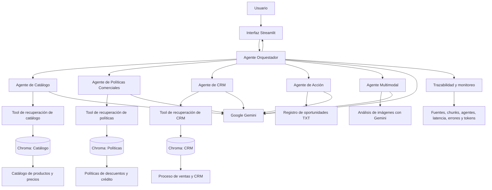
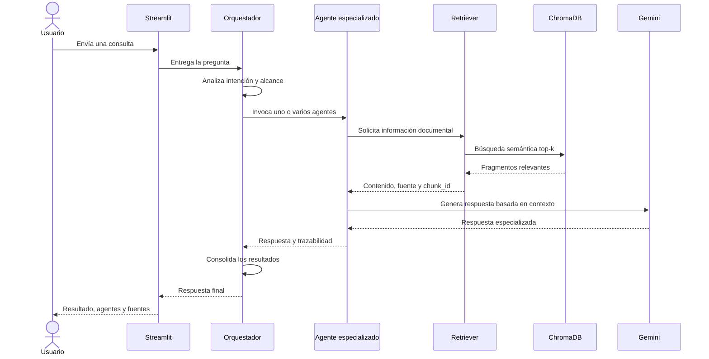

# Ejecucion del proyecto -----------------------------

# Paso a paso para la ejecucion
# Cómo ejecutar el proyecto en su estado actual

Actualmente el proyecto permite:

* Validar la conexión con Google Gemini.
* Validar el modelo de embeddings.
* Cargar y fragmentar las tres bases de conocimiento.
* Generar los tres índices vectoriales independientes en ChromaDB.

Los agentes, el orquestador y la interfaz Streamlit todavía se encuentran en desarrollo.

## 1. Clonar el repositorio

```bash
git clone https://github.com/DarkorZ/ProyectoFinal_IA_Netlife.git
```

Entrar en la carpeta del proyecto:

```bash
cd ProyectoFinal_IA_Netlife/AgentePatito_sa
```

## 2. Crear el entorno virtual

```bash
python -m venv .venv
```

Activar el entorno virtual en PowerShell:

```powershell
.\.venv\Scripts\Activate.ps1
```

Cuando el entorno esté activo, la terminal mostrará:

```text
(.venv)
```

## 3. Actualizar pip y certificados

```bash
python -m pip install --upgrade pip certifi
```

En caso de errores SSL:

```powershell
python -m pip install --upgrade pip certifi `
  --trusted-host pypi.org `
  --trusted-host files.pythonhosted.org
```

También se recomienda verificar que la fecha y hora del computador sean correctas.

## 4. Instalar las dependencias

```bash
pip install -r requirements.txt
```

Comprobar las librerías principales:

```bash
pip show langchain
pip show langchain-google-genai
pip show langchain-chroma
```

## 5. Configurar la API de Google

Crear el archivo:

```text
.env
```

en la raíz de `AgentePatito_sa`.

Agregar:

```env
GOOGLE_API_KEY=SU_API_KEY_DE_GOOGLE
```

No se deben utilizar comillas ni espacios alrededor del signo igual.

Ejemplo:

```env
GOOGLE_API_KEY=AIza...
```

El archivo `.env` está protegido mediante `.gitignore` y no debe subirse al repositorio.

También se encuentra disponible:

```text
.env.example
```

como referencia de configuración.

## 6. Verificar los documentos

Los siguientes archivos deben existir dentro de `data/`:

```text
data/
├── 01_Catalogo_Productos_Precios.txt
├── 02_Politicas_Comerciales_Descuentos_Credito.txt
└── 03_Proceso_Ventas_CRM.txt
```

## 7. Probar la conexión con Gemini

```bash
python tests/test_conexion.py
```

Esta prueba valida:

* La variable `GOOGLE_API_KEY`.
* La existencia de los documentos.
* La conexión con Gemini.
* La respuesta del modelo de chat.
* La generación de embeddings.
* La latencia de las solicitudes.

Resultado esperado:

```text
TODAS LAS PRUEBAS FINALIZARON CORRECTAMENTE
```

## 8. Probar la fragmentación

```bash
python tests/test_fragmentacion.py
```

Esta prueba:

* Lee los tres documentos.
* Los convierte en objetos `Document`.
* Genera los fragmentos.
* Verifica los metadatos.

Resultado actual:

```text
Catálogo: 3 fragmentos
Políticas: 4 fragmentos
CRM: 3 fragmentos
Total: 10 fragmentos
```

Resultado esperado:

```text
LOS TRES DOCUMENTOS SE FRAGMENTARON CORRECTAMENTE
```

## 9. Generar los índices vectoriales

```bash
python generar_indices.py
```

Este comando:

1. Carga los documentos.
2. Aplica la estrategia de fragmentación.
3. Genera embeddings con Google Gemini.
4. Limpia índices anteriores.
5. Crea tres colecciones independientes en ChromaDB.
6. Guarda los índices localmente.

Los índices se almacenan en:

```text
vectorstores/
├── catalogo/
├── politicas/
└── crm/
```

Colecciones generadas:

```text
patito_catalogo
patito_politicas
patito_crm
```

Resultado actual:

```text
Catálogo: 3 fragmentos almacenados
Políticas: 4 fragmentos almacenados
CRM: 3 fragmentos almacenados
Total: 10 fragmentos
```

Resultado esperado:

```text
LOS TRES ÍNDICES SE GENERARON CORRECTAMENTE
```

## 10. Cuándo volver a generar los índices

Se debe ejecutar nuevamente:

```bash
python generar_indices.py
```

cuando ocurra alguno de los siguientes cambios:

* Se modifica uno de los documentos TXT.
* Se cambia `CHUNK_SIZE`.
* Se cambia `CHUNK_OVERLAP`.
* Se cambia el modelo de embeddings.
* Se eliminan las carpetas de `vectorstores`.
* Se instala el proyecto en otro computador.

## Estado funcional actual

En este checkpoint se encuentra disponible:

```text
✓ Configuración del entorno
✓ Protección de credenciales
✓ Conexión con Gemini
✓ Generación de embeddings
✓ Carga de documentos
✓ Fragmentación
✓ Metadatos de trazabilidad
✓ Generación de tres índices Chroma
```

Todavía no se encuentran disponibles:

```text
✗ Consultas semánticas desde la aplicación
✗ Agentes especializados
✗ Agente orquestador
✗ Registro de oportunidades
✗ Agente multimodal
✗ Interfaz Streamlit
```

Estas funcionalidades se incorporarán en los siguientes bloques del desarrollo.


# --------------------------------------

# Proyecto Final IA — Agente Comercial Patito S.A.

## Descripción general

Este repositorio contiene el desarrollo del proyecto final del **Semillero de Inteligencia Artificial de Netlife**.

El proyecto consiste en construir una solución de inteligencia artificial para apoyar el proceso comercial ficticio de **Patito S.A.**, utilizando:

* **LangChain** para crear agentes especializados.
* **Google Gemini** como modelo de lenguaje.
* **Gemini Embeddings** para representar semánticamente los documentos.
* **ChromaDB** como base de datos vectorial.
* **RAG** para recuperar información desde documentos internos.
* **LangGraph** para memoria y control del flujo de los agentes.
* **Streamlit** para la interfaz final.

La solución busca demostrar los conocimientos aprendidos durante el Semillero mediante una arquitectura simple, funcional, segura, trazable y fácil de explicar.

---

# Objetivo del proyecto

Construir un sistema multiagente capaz de responder consultas comerciales relacionadas con:

1. Productos, precios y características.
2. Políticas comerciales, descuentos y crédito.
3. Proceso de ventas y registro en CRM.
4. Registro de oportunidades comerciales.
5. Análisis de imágenes de productos, como funcionalidad adicional.

Cada agente consulta únicamente su propia base de conocimiento. Cuando una pregunta necesita información de varios documentos, un agente orquestador determina qué especialistas deben participar y consolida sus respuestas.

---

# Principios de diseño

El desarrollo sigue los siguientes principios:

* Separación entre configuración, modelos, indexación, herramientas, agentes e interfaz.
* Una base vectorial independiente por agente RAG.
* Variables de entorno para proteger credenciales.
* Recuperación de información antes de generar respuestas.
* Presentación de fuentes y fragmentos utilizados.
* Respuesta segura cuando la información no está disponible.
* Trazabilidad de los agentes participantes.
* Control de errores de conexión, recuperación y generación.
* Posibilidad de agregar nuevos agentes sin modificar toda la aplicación.
* Solución simple y comprensible por encima de una implementación innecesariamente compleja.

---

# Arquitectura propuesta



---

# Flujo general de una consulta



---

# Bases de conocimiento

El proyecto utiliza tres documentos independientes:

```text
data/
├── 01_Catalogo_Productos_Precios.txt
├── 02_Politicas_Comerciales_Descuentos_Credito.txt
└── 03_Proceso_Ventas_CRM.txt
```

Cada documento pertenece exclusivamente a un agente.

| Documento                       | Agente responsable  | Información permitida                                       |
| ------------------------------- | ------------------- | ----------------------------------------------------------- |
| Catálogo de productos y precios | Agente de Catálogo  | Productos, precios, stock y características                 |
| Políticas comerciales           | Agente de Políticas | Descuentos, crédito, devoluciones y autorizaciones          |
| Proceso de ventas y CRM         | Agente de CRM       | Embudo comercial, campos obligatorios y proceso de registro |

Los agentes no deben responder preguntas que correspondan a otra base de conocimiento.

Por ejemplo:

* El agente de Catálogo no debe inventar descuentos.
* El agente de Políticas no debe inventar precios.
* El agente de CRM no debe responder características técnicas de productos.

Cuando una pregunta combina varias áreas, el orquestador consulta los agentes correspondientes.

---

# Estructura del proyecto

```text
AgentePatito_sa/
│
├── app.py
├── generar_indices.py
├── requirements.txt
├── README.md
├── .env
├── .env.example
├── .gitignore
│
├── data/
│   ├── 01_Catalogo_Productos_Precios.txt
│   ├── 02_Politicas_Comerciales_Descuentos_Credito.txt
│   └── 03_Proceso_Ventas_CRM.txt
│
├── vectorstores/
│   ├── catalogo/
│   ├── politicas/
│   └── crm/
│
├── src/
│   ├── __init__.py
│   ├── config.py
│   ├── modelos.py
│   ├── indexacion.py
│   ├── trazabilidad.py
│   │
│   ├── agents/
│   │   ├── __init__.py
│   │   ├── catalogo_agent.py
│   │   ├── politicas_agent.py
│   │   ├── crm_agent.py
│   │   ├── accion_agent.py
│   │   ├── multimodal_agent.py
│   │   └── orchestrator.py
│   │
│   └── tools/
│       ├── __init__.py
│       ├── retriever_tools.py
│       ├── registro_tool.py
│       └── imagen_tool.py
│
├── tests/
│   ├── test_conexion.py
│   ├── test_fragmentacion.py
│   ├── test_recuperacion.py
│   ├── test_agentes.py
│   └── casos_prueba.json
│
├── outputs/
│   └── registro_oportunidades.txt
│
└── assets/
```

Algunos archivos corresponden a etapas futuras y se incorporarán de manera progresiva.

---

# Desarrollo por bloques

## Bloque 1 — Configuración inicial

**Estado: completado**

Este bloque preparó la base técnica del proyecto.

### Actividades realizadas

* Creación del entorno virtual.
* Instalación de dependencias.
* Configuración de la API de Google.
* Protección de credenciales.
* Creación de la estructura de carpetas.
* Centralización de parámetros.
* Validación del modelo generativo.
* Validación del modelo de embeddings.

### Entorno virtual

```bash
python -m venv .venv
```

Activación en PowerShell:

```powershell
.\.venv\Scripts\Activate.ps1
```

### Actualización de pip y certificados

```bash
python -m pip install --upgrade pip certifi
```

En caso de errores relacionados con certificados:

```powershell
python -m pip install --upgrade pip certifi `
  --trusted-host pypi.org `
  --trusted-host files.pythonhosted.org
```

También se debe verificar que la fecha y hora del equipo sean correctas, porque una configuración incorrecta puede provocar errores SSL.

### Instalación de dependencias

```bash
pip install -r requirements.txt
```

Comprobación:

```bash
pip show langchain
pip show langchain-google-genai
pip show langchain-chroma
```

### Variables de entorno

El archivo `.env` contiene la credencial real:

```env
GOOGLE_API_KEY=CLAVE_REAL
```

El archivo `.env.example` contiene únicamente una plantilla:

```env
GOOGLE_API_KEY=coloque_aqui_su_api_key
```

El archivo `.env` se encuentra excluido mediante `.gitignore` y no debe subirse a GitHub.

### Configuración central

Se creó:

```text
src/config.py
```

Este archivo centraliza:

* Rutas del proyecto.
* Nombre del modelo de chat.
* Nombre del modelo de embeddings.
* Temperatura.
* Reintentos.
* Tiempo máximo de espera.
* Tamaño de chunk.
* Solapamiento.
* Valor de `top_k`.
* Rutas de documentos.
* Rutas de Chroma.
* Nombres de colecciones.
* Validaciones iniciales.

### Construcción de modelos

Se creó:

```text
src/modelos.py
```

Este archivo contiene funciones para construir:

```python
crear_modelo_chat()
crear_modelo_embeddings()
```

La centralización evita repetir la API key y los parámetros dentro de cada agente.

### Modelo generativo

Durante la validación se detectó que el modelo inicialmente configurado no estaba disponible para usuarios nuevos.

Se actualizó a:

```python
MODELO_LLM = "gemini-3.5-flash"
```

### Prueba de conexión

Se creó:

```text
tests/test_conexion.py
```

La prueba comprueba:

* Existencia de la API key.
* Existencia de los documentos.
* Conexión con Gemini.
* Generación de una respuesta.
* Generación de embeddings.
* Dimensión del vector.
* Latencia de las solicitudes.

La prueba finalizó correctamente.

---

## Bloque 2 — Preparación de las bases RAG

**Estado: parcialmente completado**

Este bloque transforma los documentos en bases de conocimiento consultables mediante recuperación semántica.

### Bloque 2.1 — Carga y fragmentación

**Estado: completado**

Se creó:

```text
src/indexacion.py
```

El módulo realiza:

1. Lectura de los documentos TXT.
2. Validación de archivos vacíos o inexistentes.
3. Conversión a objetos `Document`.
4. División en fragmentos.
5. Inclusión de metadatos de trazabilidad.

Se utilizó:

```python
RecursiveCharacterTextSplitter
```

con la configuración:

```python
CHUNK_SIZE = 500
CHUNK_OVERLAP = 80
TOP_K = 3
```

### Justificación del chunking

Los documentos son pequeños y contienen reglas o descripciones breves.

Se eligieron 500 caracteres para:

* Mantener suficiente contexto.
* Evitar enviar documentos completos al modelo.
* Recuperar información concreta.
* Reducir contenido irrelevante.

Se utilizaron 80 caracteres de solapamiento para reducir la posibilidad de dividir una regla importante entre dos fragmentos.

### Metadatos

Cada fragmento incluye:

```text
source
agent
document_type
chunk_id
characters
```

Estos metadatos serán utilizados para mostrar:

* Documento consultado.
* Agente responsable.
* Número del fragmento.
* Texto recuperado.
* Evidencia utilizada en la respuesta.

### Resultado de la fragmentación

```text
Catálogo: 3 fragmentos
Políticas: 4 fragmentos
CRM: 3 fragmentos
Total: 10 fragmentos
```

Se creó:

```text
tests/test_fragmentacion.py
```

La prueba finalizó correctamente.

---

### Bloque 2.2 — Generación de índices Chroma

**Estado: completado**

Cada grupo de fragmentos fue convertido en embeddings y almacenado en una colección Chroma independiente.

Se generaron:

```text
vectorstores/
├── catalogo/
├── politicas/
└── crm/
```

Colecciones:

```text
patito_catalogo
patito_politicas
patito_crm
```

Se creó:

```text
generar_indices.py
```

Ejecución:

```bash
python generar_indices.py
```

El script:

1. Carga los documentos.
2. Genera los fragmentos.
3. Elimina índices anteriores.
4. Genera identificadores reproducibles.
5. Convierte los fragmentos en embeddings.
6. Guarda los vectores en Chroma.
7. Verifica la cantidad almacenada.

### Identificadores de fragmentos

Ejemplos:

```text
catalogo-chunk-1
catalogo-chunk-2
politicas-chunk-1
crm-chunk-3
```

### Resultado de la indexación

```text
Catálogo: 3 fragmentos almacenados
Políticas: 4 fragmentos almacenados
CRM: 3 fragmentos almacenados
Total: 10 fragmentos
Tiempo total: 2.44 segundos
```

---

### Bloque 2.3 — Apertura de índices existentes

**Estado: pendiente**

Se crearán funciones para abrir los índices persistidos sin volver a generar embeddings.

El sistema deberá validar:

* Que las carpetas existan.
* Que los archivos internos de Chroma estén disponibles.
* Que cada colección tenga documentos.
* Que el usuario haya ejecutado previamente `generar_indices.py`.

La aplicación no deberá reconstruir los índices cada vez que se inicie.

Flujo esperado:

```text
Inicio de aplicación
        ↓
Validación de índices
        ↓
Apertura de Chroma
        ↓
Índices listos para búsqueda
```

---

### Bloque 2.4 — Recuperación semántica

**Estado: pendiente**

Se probará cada base de forma independiente antes de construir los agentes.

Ejemplos:

```text
Consulta sobre precio
        ↓
Índice de catálogo
```

```text
Consulta sobre descuento
        ↓
Índice de políticas
```

```text
Consulta sobre etapa de venta
        ↓
Índice de CRM
```

Las pruebas deberán mostrar:

* Consulta realizada.
* Fragmentos recuperados.
* Fuente.
* `chunk_id`.
* Agente propietario.
* Puntaje de similitud o relevancia.
* Tiempo de recuperación.

El objetivo es confirmar que cada índice recupera información únicamente desde su documento.

---

## Bloque 3 — Herramientas de recuperación

**Estado: pendiente**

Se crearán herramientas LangChain para que los agentes consulten sus bases.

Archivo principal:

```text
src/tools/retriever_tools.py
```

Herramientas propuestas:

```text
consultar_catalogo
consultar_politicas
consultar_crm
```

Cada herramienta deberá:

1. Recibir una pregunta.
2. Consultar su índice.
3. Recuperar los fragmentos más relevantes.
4. Devolver contenido y metadatos.
5. Indicar cuando no existe información suficiente.
6. Evitar consultar documentos de otros agentes.

Ejemplo de salida interna:

```text
Agente: catalogo
Fuente: 01_Catalogo_Productos_Precios.txt
Chunk: 2
Contenido: ...
```

Estas herramientas funcionarán como puente entre los agentes y Chroma.

---

## Bloque 4 — Agentes RAG especializados

**Estado: pendiente**

Se crearán tres agentes LangChain independientes.

### Agente de Catálogo

Archivo:

```text
src/agents/catalogo_agent.py
```

Responsabilidades:

* Consultar productos.
* Consultar precios.
* Consultar stock.
* Consultar características técnicas.

Restricciones:

* No inventar descuentos.
* No responder reglas de crédito.
* No responder procedimientos CRM.

---

### Agente de Políticas Comerciales

Archivo:

```text
src/agents/politicas_agent.py
```

Responsabilidades:

* Consultar descuentos.
* Consultar niveles de autorización.
* Consultar políticas de crédito.
* Consultar devoluciones y garantías.

Restricciones:

* No inventar precios.
* No responder características de productos.
* No registrar oportunidades.

---

### Agente de CRM

Archivo:

```text
src/agents/crm_agent.py
```

Responsabilidades:

* Consultar etapas del embudo.
* Consultar campos obligatorios.
* Consultar procedimientos de ventas.
* Consultar requisitos para cerrar oportunidades.

Restricciones:

* No inventar precios.
* No aprobar descuentos.
* No modificar registros directamente.

---

### Estructura de respuesta esperada

Cada agente deberá devolver:

```text
Respuesta
Advertencias
Fuente
Fragmentos utilizados
Agente responsable
```

Si la documentación no contiene la respuesta:

```text
No se encontró información suficiente en la base de conocimiento asignada.
```

---

## Bloque 5 — Agente orquestador

**Estado: pendiente**

Archivo:

```text
src/agents/orchestrator.py
```

El orquestador será el punto central de la solución.

Responsabilidades:

1. Recibir la consulta del usuario.
2. Analizar qué tipo de información necesita.
3. Seleccionar uno o varios agentes.
4. Invocar las herramientas correspondientes.
5. Consolidar los resultados.
6. Mostrar los agentes utilizados.
7. Mostrar fuentes y fragmentos.
8. Evitar responder directamente con información no validada.

Ejemplo de consulta simple:

```text
¿Cuánto cuesta el producto X?
```

Agente utilizado:

```text
Catálogo
```

Ejemplo de consulta combinada:

```text
¿Cuánto cuesta el producto X, qué descuento puedo ofrecer
y cómo registro la oportunidad?
```

Agentes utilizados:

```text
Catálogo
Políticas Comerciales
CRM
```

El orquestador no reemplaza a los agentes especializados; su función es coordinar el trabajo.

---

## Bloque 6 — Agentes adicionales

**Estado: pendiente**

La solución incluirá al menos un agente adicional.

### Bloque 6.1 — Agente de acción

Archivo:

```text
src/agents/accion_agent.py
```

Herramienta:

```text
src/tools/registro_tool.py
```

Permitirá registrar una oportunidad comercial en:

```text
outputs/registro_oportunidades.txt
```

Flujo:

```text
Solicitud del usuario
        ↓
Validación de campos
        ↓
Solicitud de información faltante
        ↓
Confirmación del usuario
        ↓
Registro
        ↓
ID único y fecha
```

El agente deberá:

* Validar campos obligatorios.
* No registrar datos incompletos.
* Solicitar confirmación.
* Evitar duplicados.
* Generar un identificador único.
* Guardar fecha y hora.
* Informar el resultado de la acción.

---

### Bloque 6.2 — Agente multimodal

Archivo:

```text
src/agents/multimodal_agent.py
```

Herramienta:

```text
src/tools/imagen_tool.py
```

Permitirá recibir una imagen y utilizar Gemini para identificar información visual.

Flujo propuesto:

```text
Imagen
   ↓
Gemini multimodal
   ↓
Descripción o identificación
   ↓
Consulta al agente de Catálogo
   ↓
Validación contra documentación
```

La salida visual no se aceptará directamente como verdad. Debe verificarse contra la base de conocimiento de catálogo.

Esta funcionalidad será adicional y no deberá dificultar la ejecución principal.

---

## Bloque 7 — Memoria, seguridad y trazabilidad

**Estado: pendiente**

### Memoria conversacional

Se utilizará:

```python
InMemorySaver
```

Cada conversación tendrá un:

```text
thread_id
```

Esto permitirá mantener contexto entre preguntas relacionadas.

---

### Seguridad

Se implementarán reglas para:

* No exponer la API key.
* No imprimir variables sensibles.
* No revelar el system prompt.
* No obedecer instrucciones externas que contradigan las reglas.
* Tratar documentos recuperados como datos, no como comandos.
* Validar información antes de ejecutar acciones.
* No registrar información sensible en logs.
* Responder de forma segura ante errores o falta de información.

---

### Permisos propuestos

El proyecto documentará un modelo de permisos por agente:

| Rol               | Catálogo | Políticas | CRM | Acción |
| ----------------- | -------: | --------: | --: | -----: |
| Usuario comercial |       Sí |  Limitado |  Sí |     Sí |
| Supervisor        |       Sí |        Sí |  Sí |     Sí |
| Administrador     |       Sí |        Sí |  Sí |     Sí |

No es obligatorio implementar autenticación completa, pero se documentará cómo podría restringirse el acceso a herramientas y documentos.

---

### Trazabilidad

Cada respuesta podrá registrar:

```text
timestamp
consulta
agentes participantes
modelo utilizado
fuentes
chunk_id
cantidad de fragmentos
latencia
resultado
error
```

No se almacenará:

```text
API key
system prompt
cabeceras de autenticación
vectores completos
información sensible innecesaria
```

---

## Bloque 8 — Interfaz Streamlit

**Estado: pendiente**

Archivo:

```text
app.py
```

La interfaz permitirá:

* Escribir consultas.
* Visualizar respuestas.
* Mantener el historial.
* Mostrar agentes participantes.
* Mostrar fuentes.
* Mostrar fragmentos recuperados.
* Cargar imágenes.
* Confirmar acciones.
* Mostrar errores controlados.
* Reiniciar una conversación.

La interfaz se mantendrá sencilla, funcional y fácil de presentar.

Ejecución esperada:

```bash
streamlit run app.py
```

---

## Bloque 9 — Pruebas y evaluación

**Estado: pendiente**

Se implementará una matriz de pruebas que cubra:

1. Consulta de catálogo.
2. Consulta de políticas.
3. Consulta de CRM.
4. Consulta combinada.
5. Pregunta fuera de alcance.
6. Información inexistente.
7. Falta de información para una acción.
8. Confirmación de registro.
9. Prevención de duplicados.
10. Consulta con imagen.
11. Error de API.
12. Índice vectorial inexistente.

### Métricas propuestas

* Exactitud documental.
* Fuente correcta.
* Fragmento correcto.
* Control de alucinaciones.
* Tiempo de recuperación.
* Tiempo total de respuesta.
* Número de agentes invocados.
* Cantidad de tokens.
* Errores por consulta.
* Feedback del usuario.

---

## Bloque 10 — Documentación y entrega final

**Estado: pendiente**

La etapa final incluirá:

* README completo.
* Explicación de arquitectura.
* Instrucciones de instalación.
* Procedimiento para crear índices.
* Procedimiento para iniciar la aplicación.
* Justificación del modelo Gemini.
* Justificación del modelo de embeddings.
* Justificación del chunking.
* Justificación de `top_k`.
* Explicación de trade-offs.
* Control de alucinaciones.
* Propuesta de permisos.
* Propuesta de monitoreo.
* Matriz de pruebas.
* Capturas de funcionamiento.
* Documento final.
* Video de demostración.
* Revisión del repositorio de GitHub.

---

# Estado actual del proyecto

```text
BLOQUE 1 — Configuración inicial
└── Completado

BLOQUE 2 — Preparación de las bases RAG
├── 2.1 Carga y fragmentación
│   └── Completado
├── 2.2 Generación de índices Chroma
│   └── Completado
├── 2.3 Apertura de índices existentes
│   └── Pendiente
└── 2.4 Recuperación semántica
    └── Pendiente

BLOQUE 3 — Herramientas de recuperación
└── Pendiente

BLOQUE 4 — Agentes RAG especializados
└── Pendiente

BLOQUE 5 — Orquestador
└── Pendiente

BLOQUE 6 — Agentes adicionales
└── Pendiente

BLOQUE 7 — Memoria, seguridad y trazabilidad
└── Pendiente

BLOQUE 8 — Interfaz Streamlit
└── Pendiente

BLOQUE 9 — Pruebas y métricas
└── Pendiente

BLOQUE 10 — Documentación y entrega
└── Pendiente
```

---

# Ejecución actual

## Crear entorno

```bash
python -m venv .venv
```

## Activar entorno

```powershell
.\.venv\Scripts\Activate.ps1
```

## Instalar dependencias

```bash
pip install -r requirements.txt
```

## Configurar API key

Crear `.env`:

```env
GOOGLE_API_KEY=CLAVE_REAL
```

## Probar conexión

```bash
python tests/test_conexion.py
```

## Probar fragmentación

```bash
python tests/test_fragmentacion.py
```

## Generar índices

```bash
python generar_indices.py
```

---

# Resultados obtenidos hasta el checkpoint actual

```text
Conexión Gemini: correcta
Embeddings: correctos
Documentos cargados: 3
Fragmentos generados: 10
Índices Chroma generados: 3
Fragmentos almacenados: 10
Tiempo de indexación: 2.44 segundos
```

El siguiente paso del desarrollo corresponde a:

```text
Bloque 2.3 — Apertura de los índices existentes
Bloque 2.4 — Pruebas de recuperación semántica
```
